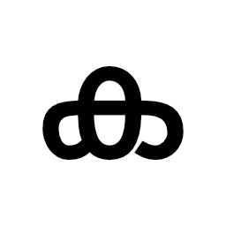
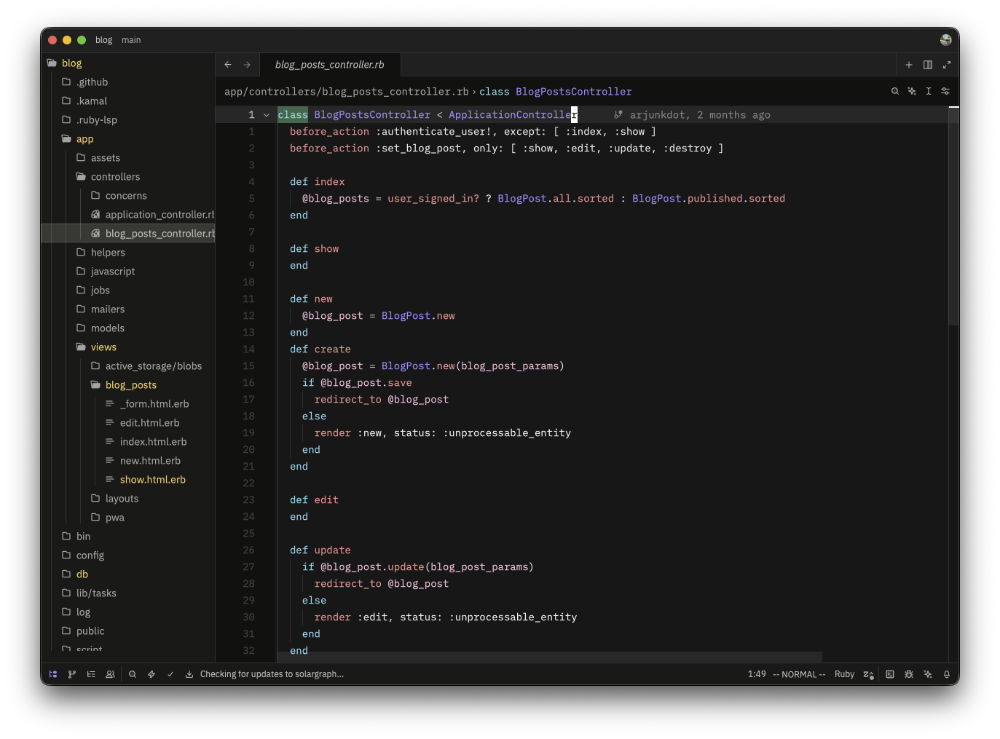
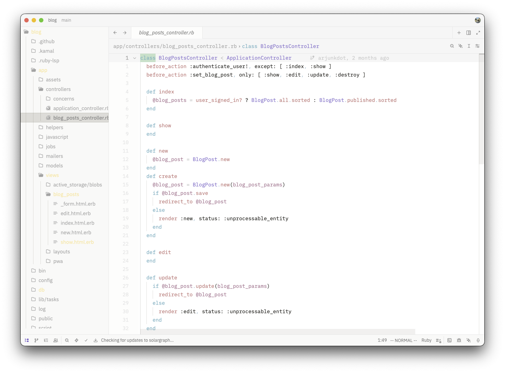

# Kadalas

> [!WARNING]
> This is theme is in beta and some colors or features may be missing or not work as expected.
>

Kadalas (കടലാസ്) /kəɖəlaːs/ is a minimalist, yet colorful theme primarily designed and built for Zed. 
This started out as I was looking for a theme that suits my taste but couldn\'t find one.
The project is still in beta, and some colors might be missing as of now. 
But I\'m constantly working and fine-tuning the theme to make it complete. Right now, only available for Zed. Available in both light and dark mode.

## Screenshots

*Kadalas Dark*

*Kadalas Light*

## Installation
1. Download the latest release from [GitHub](https://github.com/arjunkdot/kadalas/releases).
2. Extract the downloaded file.
3. Move the extracted folder to your Zed themes directory `~/.config/zed/themes`.
4. Restart Zed.

## License
[GPLv3](https://www.gnu.org/licenses/gpl-3.0.txt)
